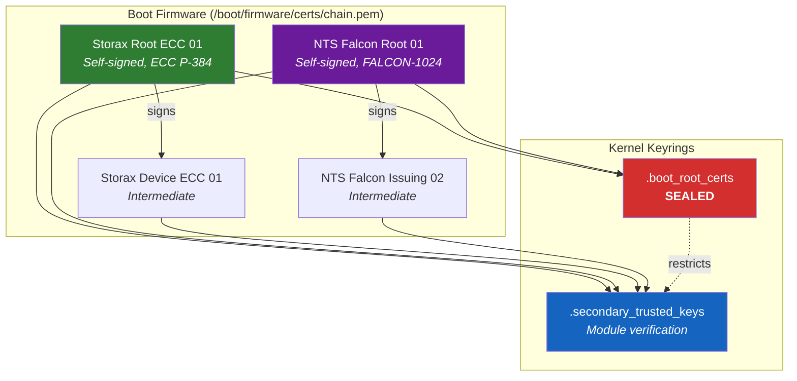
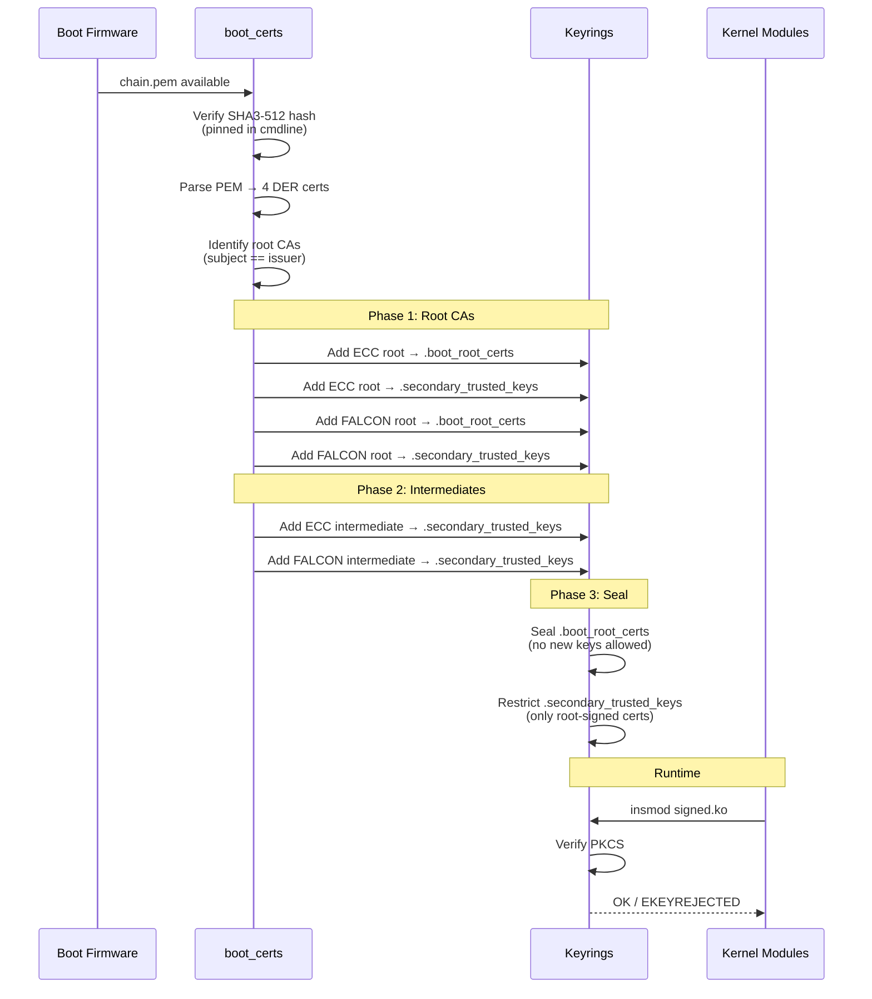
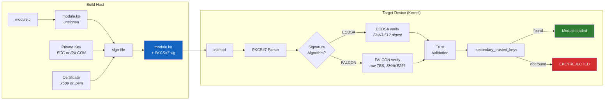
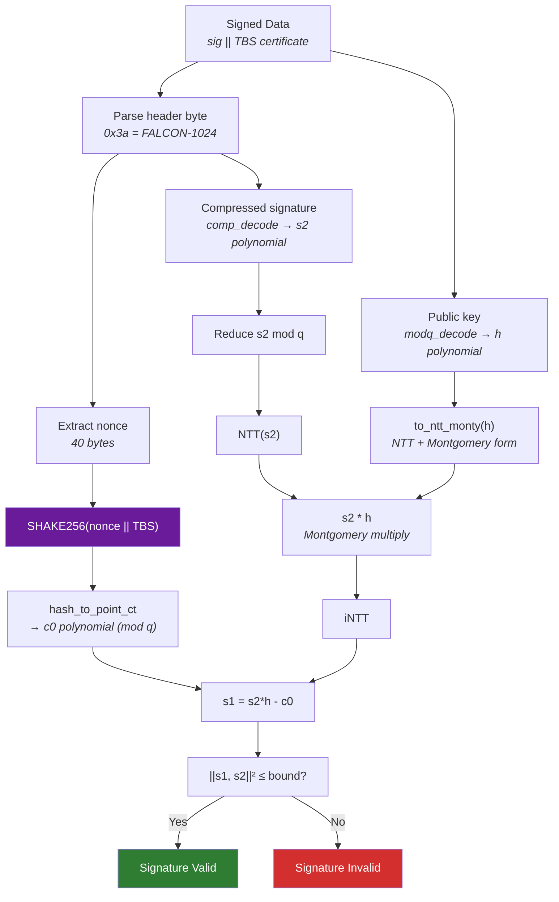
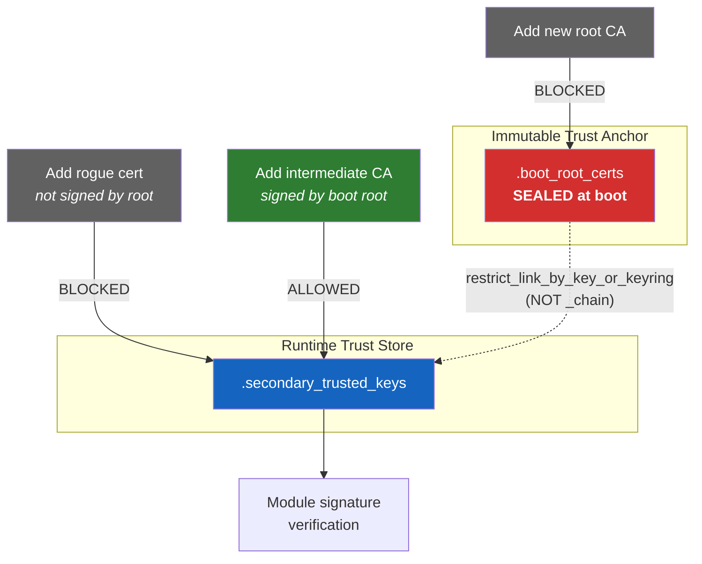

# Boot Certificate & PQC Module Signing - Solution Summary

## Overview

A **hierarchical two-keyring PKI system** with support for both classical (ECC)
and post-quantum (FALCON-1024) kernel module signing:

- Root certificates locked and immutable after boot
- New intermediate CAs can be added if signed by a root
- Kernel modules verified with ECDSA or FALCON-1024 signatures
- PKCS#7 signature validation through the standard kernel infrastructure

## Certificate Trust Hierarchy



## Boot Sequence



## Module Signing Flow



## FALCON-1024 Verification Pipeline



## Keyring Security Model



## Key Components

### Kernel Crypto: FALCON-1024 Verification (`crypto/falcon/`)

| File | Purpose |
|------|---------|
| `falcon_verify.c` | Kernel crypto API integration (akcipher interface) |
| `pqclean_verify.c` | PQClean FALCON verification wrapper |
| `vrfy.c` | NTT, Montgomery arithmetic, verify_raw |
| `common.c` | hash_to_point, is_short norm check |
| `codec.c` | Signature/public key encoding/decoding |
| `shake256_kernel.h` | SHAKE256 using kernel's Keccak permutation |
| `inner.h` | Internal API mapping PQClean to kernel |

### Module Signing (`scripts/sign-file.c`)

Extended to support PQC signatures:
- Detects FALCON keys via oqs-provider
- Constructs PKCS#7 SignedData with FALCON OIDs (1.3.9999.3.9)
- Uses SHA3-512 as the placeholder digest algorithm
- Signs raw module data via EVP_DigestSign (FALCON handles hashing internally)

### X.509 Certificate Parsing (`crypto/asymmetric_keys/`)

| File | Changes |
|------|---------|
| `x509_cert_parser.c` | Strip BIT STRING unused-bits for FALCON sig/pubkey |
| `x509_public_key.c` | Raw TBS as digest when hash_algo=NULL (FALCON) |
| `pkcs7_parser.c` | Recognize FALCON OIDs, set pkey_algo="falcon-1024" |

### Boot Certificate Loader (`security/boot_certs/`)

| File | Purpose |
|------|---------|
| `boot_certs_sysfs.c` | Loads chain.pem, parses certs, populates keyrings |
| `boot_certs_crl.c` | Certificate revocation list support |

### OID Registry (`include/linux/oid_registry.h`)

Added FALCON-512 (1.3.9999.3.6) and FALCON-1024 (1.3.9999.3.9) OIDs.

## Critical Bugs Fixed

### 1. SHAKE256 Squeeze Block Boundary Bug

**File:** `crypto/falcon/shake256_kernel.h`

The squeeze function never permuted the Keccak state when small extraction
calls (2 bytes) aligned exactly with the 136-byte block boundary. After 68
calls consumed one full block, subsequent reads returned **the same block**
instead of fresh output.

**Impact:** hash_to_point_ct produced correct output for only the first 68
of 1024 polynomial elements. The remaining 956 elements were wrong, making
the computed s1 effectively random and the norm check overflow.

**Fix:** Check for block boundary at the start of each iteration:
```c
if (offset == 0 && sc->squeezed > 0)
    crypto_sha3_permute(sc->state.st);
```

### 2. Scatterlist Data Extraction Bug

**File:** `crypto/falcon/falcon_verify.c`

The verify function read the message from `req->dst` (which is NULL for
verify operations). The kernel's akcipher verify API places both signature
and message concatenated in `req->src`.

**Fix:** Use `sg_pcopy_to_buffer(req->src, ..., total_len, 0)` to read
the combined [signature || message] buffer from req->src.

### 3. Boot Cert Root CA Count

**File:** `security/boot_certs/boot_certs_sysfs.c`

The summary log used a hardcoded estimate instead of the actual root CA count.
Fixed to iterate and count self-signed certificates.

## Building

```bash
# Prerequisites: oqs-provider for OpenSSL (FALCON key generation/signing)
# See: https://github.com/open-quantum-safe/oqs-provider

cd /home/hs/linux-rpi

# Build kernel + modules
make -j$(nproc) Image.gz modules

# Install
sudo mount -o remount,rw /boot/firmware
sudo cp arch/arm64/boot/Image.gz /boot/firmware/kernel8.img
sudo make modules_install
```

## Signing Kernel Modules

### ECC (ECDSA with SHA3-512)
```bash
scripts/sign-file sha3-512 <private_key.pem> <certificate.x509> module.ko
```

### FALCON-1024 (Post-Quantum)
```bash
scripts/sign-file falcon-1024 <falcon_private.key> <falcon_cert.pem> module.ko
```

## Verification

```bash
# Check boot_certs loaded
cat /sys/kernel/boot_certs/ok          # true
cat /sys/kernel/boot_certs/status      # detailed status

# Check keyrings
sudo keyctl list @boot_root_certs      # root CAs
sudo keyctl list @s                    # all trusted keys

# Test module loading
sudo insmod hello.ko                   # signed module loads
sudo insmod unsigned.ko                # rejected: EKEYREJECTED
```

## Test Suite

```bash
cd security/boot_certs/tests
source venv/bin/activate
sudo pytest test_boot_certs.py -v      # 28 passed, 6 skipped
```

| Category | Tests | Description |
|----------|-------|-------------|
| Certificate Generation | 5 | Create root/intermediate/expired certs |
| Expiry Detection | 6 | WARN/REJECT/STRICT policy logic |
| ECC Signing | 6 | Build, sign, load, reject unsigned |
| FALCON Signing | 5 | Sign, load, verify PQC signatures |
| Kernel Integration | 6 | sysfs, keyrings, expiry checks |
| Hierarchical Sealing | 2 | Block rogue roots (requires sealed) |
| EST/REST | 4 | Skipped (future) |

## Security Model

| Scenario | Prevented? | How |
|----------|-----------|-----|
| Add rogue root CA | Yes | boot_root_certs is sealed |
| Add cert signed by intermediate | Yes | secondary restricted to root-signed only |
| Add cert signed by boot root | Allowed | Intended use case |
| Replace boot chain.pem | Yes | SHA3-512 hash pinning + RO filesystem |
| Load unsigned module | Yes | MODULE_SIG_FORCE rejects |
| Load wrong-key-signed module | Yes | PKCS#7 trust validation fails |

## Boot Parameters

```
boot_certs.sha3=<128 hex chars of SHA3-512 hash of chain.pem>
```
